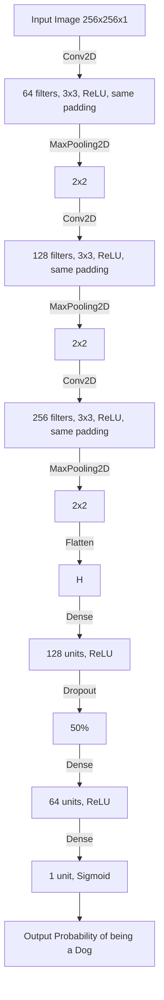

# DIY Deep Learning with Keras

This repository contains a deep learning model for classifying images of cats and dogs using Keras and TensorFlow. The model is built using convolutional neural networks (CNNs) and can be trained and evaluated using a Streamlit interface.

## Model Architecture



## Detailed Explanation of Layers and Architecture

### 1. Input Layer
- **Shape**: (256, 256, 1)
- **Description**: The input layer expects grayscale images of size 256x256 pixels.

### 2. Conv2D Layer
- **Filters**: 64
- **Kernel Size**: (3,3)
- **Activation**: ReLU
- **Padding**: Same
- **Description**: This layer applies 64 convolutional filters to the input image, each of size 3x3. The ReLU activation function introduces non-linearity, and 'same' padding ensures the output size remains 256x256.

### 3. MaxPooling2D Layer
- **Pool Size**: (2,2)
- **Description**: This layer reduces the spatial dimensions of the image by taking the maximum value in each 2x2 window, resulting in an output size of 128x128.

### 4. Conv2D Layer
- **Filters**: 128
- **Kernel Size**: (3,3)
- **Activation**: ReLU
- **Padding**: Same
- **Description**: This layer applies 128 convolutional filters to the input, each of size 3x3. The ReLU activation function introduces non-linearity, and 'same' padding ensures the output size remains 128x128.

### 5. MaxPooling2D Layer
- **Pool Size**: (2,2)
- **Description**: This layer reduces the spatial dimensions of the image by taking the maximum value in each 2x2 window, resulting in an output size of 64x64.

### 6. Conv2D Layer
- **Filters**: 256
- **Kernel Size**: (3,3)
- **Activation**: ReLU
- **Padding**: Same
- **Description**: This layer applies 256 convolutional filters to the input, each of size 3x3. The ReLU activation function introduces non-linearity, and 'same' padding ensures the output size remains 64x64.

### 7. MaxPooling2D Layer
- **Pool Size**: (2,2)
- **Description**: This layer reduces the spatial dimensions of the image by taking the maximum value in each 2x2 window, resulting in an output size of 32x32.

### 8. Flatten Layer
- **Description**: This layer flattens the 3D output of the previous layer into a 1D vector, preparing it for the fully connected layers.

### 9. Dense Layer
- **Units**: 128
- **Activation**: ReLU
- **Description**: This fully connected layer has 128 neurons, each connected to every neuron in the previous layer. The ReLU activation function introduces non-linearity.

### 10. Dropout Layer
- **Rate**: 0.5
- **Description**: This layer randomly drops 50% of the neurons during training to prevent overfitting.

### 11. Dense Layer
- **Units**: 64
- **Activation**: ReLU
- **Description**: This fully connected layer has 64 neurons, each connected to every neuron in the previous layer. The ReLU activation function introduces non-linearity.

### 12. Dense Layer
- **Units**: 1
- **Activation**: Sigmoid
- **Description**: This output layer has a single neuron with a sigmoid activation function, which outputs a probability between 0 and 1. This probability indicates the likelihood of the input image being a dog.

### 13. Output
- **Description**: The final output is a probability indicating whether the input image is a dog (closer to 1) or a cat (closer to 0).

## Hyperparameters

### Learning Rate
- **Description**: The step size the optimizer takes during gradient descent.
- **Values**: Common values are 0.0001, 0.001, 0.01.
- **Example**: A learning rate of 0.001 means the optimizer updates the model parameters by 0.1% of the gradient value.

### Epochs
- **Description**: The number of times the entire dataset is passed through the network during training.
- **Values**: Typically ranges from 1 to 50 or more.
- **Example**: Training for 10 epochs means the model sees each training sample 10 times.

### Batch Size
- **Description**: The number of samples processed before the model's internal parameters are updated.
- **Values**: Common values are 16, 32, 64, 128.
- **Example**: A batch size of 32 means the model processes 32 samples at a time before updating the weights.

## Optimizers

### Adam (Adaptive Moment Estimation)
- **Description**: An optimizer that adjusts the learning rate for each parameter based on the first and second moments of the gradients.
- **Parameters**:
  - `learning_rate`: Initial learning rate (e.g., 0.001).
- **Example**: Adam optimizer with a learning rate of 0.001 adapts the learning rate for each parameter, making it suitable for a wide range of problems.

## Metrics

### Accuracy
- **Description**: The percentage of correctly classified samples out of the total samples.
- **Usage**: Commonly used for classification problems to measure the model's performance.
- **Example**: An accuracy of 90% means the model correctly classified 90% of the samples.

## Usage

### Training the Model

1. **Install Dependencies**:
   ```bash
   pip install -r requirements.txt
   ```

2. **Run the Streamlit App**:
   ```bash
   streamlit run KerasTrainer.py
   ```

3. **Configure Training Parameters**:
   - Set the training and testing data paths.
   - Choose the learning rate, number of epochs, and batch size.

4. **Train the Model**:
   - Click the "Train Model" button to start training.
   - Monitor the training progress and metrics in real-time.

### Making Predictions

1. **Load a Sample Image**:
   - Provide the path to a sample image in the sidebar.

2. **Predict**:
   - Click the "Predict" button to classify the image.
   - View the predicted class and probability.

## Example

### Training Example

```python
# Example of training configuration
train_path = "dataset/training_set/training_set"
test_path = "dataset/test_set/test_set"
learning_rate = 0.001
epochs = 10
batch_size = 32
```

### Prediction Example

```python
# Example of prediction configuration
sample_image_path = "images/dog1.jpg"
```

---

By understanding these components, you can better grasp how the model works and how to adjust it for different tasks or datasets. The visual representation using Mermaid helps to see the flow of data through the layers, making it easier to understand the architecture.

Feel free to explore and modify the code to suit your needs! If you have any questions or suggestions, please open an issue or submit a pull request.

Happy coding! 🚀

---
